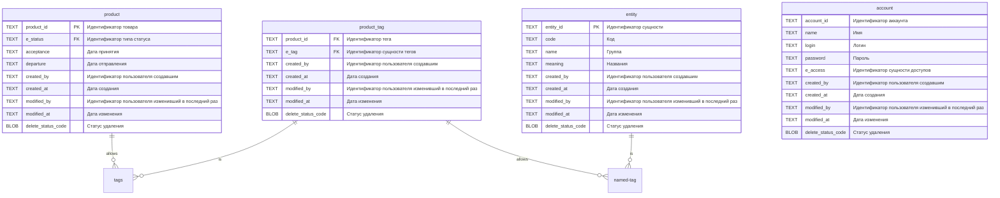

# Приложения для учета товара на складе

БД для данного проекта:

```mermaid
	erDiagram
	product ||--o{ tags : allows 
    product {
      TEXT product_id PK "Идентификатор товара"
      TEXT e_status FK "Идентификатор типа статуса"
      TEXT acceptance "Дата принятия"
      TEXT departure "Дата отправления"
      TEXT created_by "Идентификатор пользователя создавшим"
      TEXT created_at "Дата создания"
      TEXT modified_by "Идентификатор пользователя изменивший в последний раз"
      TEXT modified_at "Дата изменения"
      BLOB delete_status_code "Статус удаления"
    }
	product_tag ||--o{ tags : is
	product_tag ||--o{ named-tag : allows
	product_tag {
      TEXT product_id FK "Идентификатор тега"
      TEXT e_tag FK "Идентификатор сущности тегов"
      TEXT created_by "Идентификатор пользователя создавшим"
      TEXT created_at "Дата создания"
      TEXT modified_by "Идентификатор пользователя изменивший в последний раз"
      TEXT modified_at "Дата изменения"
      BLOB delete_status_code "Статус удаления"
    }
	entity ||--o{ named-tag : is
	entity {
		TEXT entity_id PK "Идентификатор сущности"
		TEXT code "Код"
		TEXT name "Группа"
		TEXT meaning "Названия"
      	TEXT created_by "Идентификатор пользователя создавшим"
      	TEXT created_at "Дата создания"
      	TEXT modified_by "Идентификатор пользователя изменивший в последний раз"
      	TEXT modified_at "Дата изменения"
      	BLOB delete_status_code "Статус удаления"
	}
	account {
		TEXT account_id "Идентификатор аккаунта"
		TEXT name "Имя"
		TEXT login "Логин"
		TEXT password "Пароль"
		TEXT e_access "Идентификатор сущности доступов"
      	TEXT created_by "Идентификатор пользователя создавшим"
      	TEXT created_at "Дата создания"
      	TEXT modified_by "Идентификатор пользователя изменивший в последний раз"
      	TEXT modified_at "Дата изменения"
      	BLOB delete_status_code "Статус удаления"
	}
```

